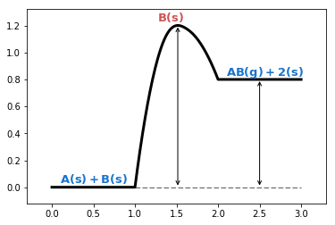

添加反应物产物信息
==================

.. code:: ipython3

    %matplotlib inline

.. code:: ipython3

    from catplot.ep_components.ep_canvas import EPCanvas
    from catplot.ep_components.ep_lines import ElementaryLine

创建画布
--------

.. code:: ipython3

    canvas = EPCanvas()

.. image:: output_4_0.png

创建带有反应的Energy Profile Line
---------------------------------

.. code:: ipython3

    line = ElementaryLine([0.0, 1.2, 0.8], rxn_equation="A_s + B_s <-> A-B_2s -> AB_g + 2_s")

添加到画布中
------------

.. code:: ipython3

    canvas.add_line(line)

添加辅助线和物种注释
--------------------

.. code:: ipython3

    canvas.add_horizontal_auxiliary_line(line)
    canvas.add_vertical_auxiliary_lines(line)

.. parsed-literal::

    <catplot.ep_components.ep_canvas.EPCanvas at 0x10a6234a8>

.. code:: ipython3

    canvas.add_species_annotations(line)

.. parsed-literal::

    <catplot.ep_components.ep_canvas.EPCanvas at 0x10a6234a8>

效果
----

.. code:: ipython3

    canvas.draw()
    canvas.figure

