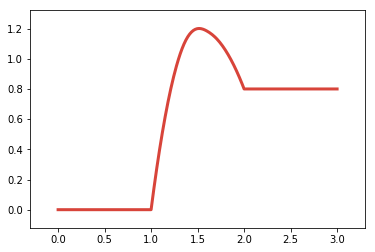

改变线条颜色
============

.. code:: ipython3

    %matplotlib inline

.. code:: ipython3

    from catplot.ep_components.ep_canvas import EPCanvas
    from catplot.ep_components.ep_lines import ElementaryLine

创建画布
--------

.. code:: ipython3

    canvas = EPCanvas()

.. image:: output_4_0.png

创建一条红色的 Energy Profile Line
----------------------------------

.. code:: ipython3

    line = ElementaryLine([0.0, 1.2, 0.8], color="#D8443A")

添加到画布中
------------

.. code:: ipython3

    canvas.add_line(line)

效果
----

.. code:: ipython3

    canvas.draw()
    canvas.figure

