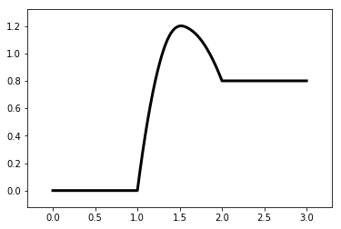
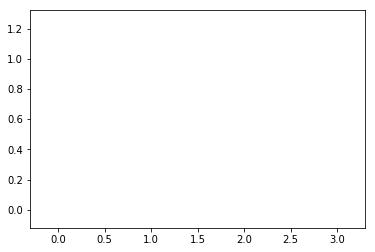

.. code:: ipython3

    %matplotlib inline

清空你的画布
============

.. code:: ipython3

    from catplot.ep_components.ep_canvas import EPCanvas
    from catplot.ep_components.ep_lines import ElementaryLine

创建画布
--------

.. code:: ipython3

    canvas = EPCanvas()

.. image:: output_4_0.png

添加一条线
----------

.. code:: ipython3

    line = ElementaryLine([0.0, 1.2, 0.8])

.. code:: ipython3

    canvas.add_line(line)
    canvas.draw()
    canvas.figure

使用\ ``clear``\ 方法清空当前显示在画布上的内容，line本身没有清除
-----------------------------------------------------------------

.. code:: ipython3

    canvas.clear()

.. code:: ipython3

    canvas.figure

重新绘制可以再次看到线
----------------------

.. code:: ipython3

    canvas.draw()
    canvas.figure

.. image:: output_12_0.png

彻底清除
--------

.. code:: ipython3

    canvas.deep_clear()

再次重新绘制则会报错，canvas已经为空
------------------------------------

.. code:: ipython3

    canvas.draw()

::

    ---------------------------------------------------------------------------

    AttributeError                            Traceback (most recent call last)

    <ipython-input-10-f025f76b7c0b> in <module>()
    ----> 1 canvas.draw()
    

    /Users/zjshao/Documents/repos/catplot/catplot/ep_components/ep_canvas.py in draw(self)
        323         """
        324         if not self.lines:
    --> 325             raise AttributeError("Can't draw an empty canvas")
        326 
        327         # Draw energy profile lines.

    AttributeError: Can't draw an empty canvas

