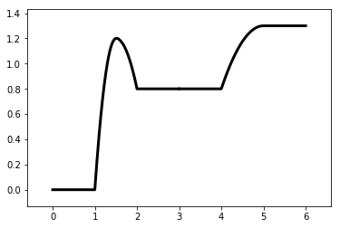

使用 ``EPChain`` 拼接多条Energy Profile Line
============================================

.. code:: ipython3

    %matplotlib inline

导入画布，线以及链
------------------

.. code:: ipython3

    from catplot.ep_components.ep_canvas import EPCanvas
    from catplot.ep_components.ep_lines import ElementaryLine
    from catplot.ep_components.ep_chain import EPChain

创建画布和两条线
----------------

.. code:: ipython3

    canvas = EPCanvas()

.. image:: output_5_0.png

.. code:: ipython3

    # 第一条线
    line1 = ElementaryLine([0.0, 1.2, 0.8])

.. code:: ipython3

    # 第二条线
    line2 = ElementaryLine([0.0, 0.5])

使用\ ``EPChain``\ 进行拼接
---------------------------

.. code:: ipython3

    chain = EPChain([line1, line2])  # 参数中的顺序就是拼接顺序（line2会拼接在line1后面）

将\ ``chain``\ 导入画布
-----------------------

.. code:: ipython3

    canvas.add_chain(chain)

绘制并显示效果
--------------

.. code:: ipython3

    canvas.draw()
    canvas.figure

