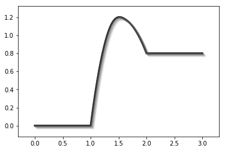

给Energy Profile 添加阴影
=========================

.. code:: ipython3

    %matplotlib inline

.. code:: ipython3

    from catplot.ep_components.ep_canvas import EPCanvas
    from catplot.ep_components.ep_lines import ElementaryLine

创建画布
--------

.. code:: ipython3

    canvas = EPCanvas()

.. image:: output_4_0.png

创建Energy Profile Line
-----------------------

.. code:: ipython3

    line = ElementaryLine([0.0, 1.2, 0.8], shadow_depth=6, shadow_color="#595959")  # 添加阴影深度和颜色

添加到画布中
------------

.. code:: ipython3

    canvas.add_line(line)
    canvas.draw()

效果
----

.. code:: ipython3

    canvas.figure

