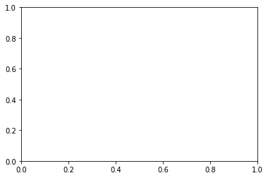
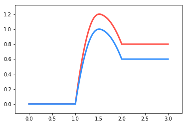

同时绘制多条Energy Profile Line
===============================

.. code:: ipython3

    %matplotlib inline

.. code:: ipython3

    from catplot.ep_components.ep_canvas import EPCanvas
    from catplot.ep_components.ep_lines import ElementaryLine

创建画布
--------

.. code:: ipython3

    canvas = EPCanvas()

创建第一条线
------------

.. code:: ipython3

    line1 = ElementaryLine([0.0, 1.2, 0.8], color="#FF544C")  # 红色

创建第二条线
------------

.. code:: ipython3

    line2 = ElementaryLine([0.0, 1.0, 0.6], color="#3490FD")  # 蓝色

将两条线添加到画布中
--------------------

.. code:: ipython3

    # 可以一次性添加多条
    canvas.add_lines([line1, line2])
    
    # 也可以分多次添加，例如
    # canvas.add_line(line1)
    # canvas.add_line(line2)

绘制
----

.. code:: ipython3

    canvas.draw()

效果
----

.. code:: ipython3

    canvas.figure

