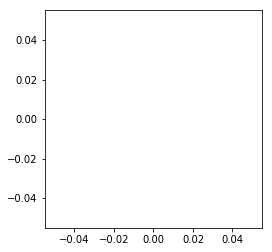
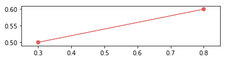

.. code:: ipython3

    %matplotlib inline

添加 edge
=========

创建画布
--------

.. code:: ipython3

    from catplot.grid_components.grid_canvas import Grid2DCanvas

.. code:: ipython3

    canvas = Grid2DCanvas()

创建两个Node
------------

.. code:: ipython3

    from catplot.grid_components.nodes import Node2D

.. code:: ipython3

    n1, n2 = Node2D([0.3, 0.5], color="#DC5F5B", size=800), Node2D([0.8, 0.6], color="#DC5F5B", size=800)

创建 Edge
---------

.. code:: ipython3

    from catplot.grid_components.edges import Edge2D

.. code:: ipython3

    edge = Edge2D(n1, n2, color="#DC5F5B")

将Node和Edge加入画布
--------------------

.. code:: ipython3

    canvas.add_nodes([n1, n2])

.. code:: ipython3

    canvas.add_edge(edge)

.. code:: ipython3

    canvas.draw()

.. code:: ipython3

    canvas.figure

