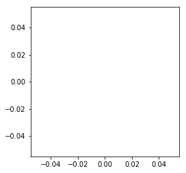
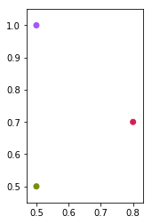

.. code:: ipython3

    %matplotlib inline

向\ ``Grid2DCanvas``\ 中添加散点
================================

创建画布
--------

.. code:: ipython3

    from catplot.grid_components.grid_canvas import Grid2DCanvas

.. code:: ipython3

    canvas = Grid2DCanvas()

创建nodes
---------

.. code:: ipython3

    from catplot.grid_components.nodes import Node2D

.. code:: ipython3

    node1 = Node2D([0.5, 0.5], color="#7A8E02", size=600)
    node2 = Node2D([0.5, 1.0], color="#A555FB", size=600)
    node3 = Node2D([0.8, 0.7], color="#D11F54", size=600)

添加到画布中
------------

.. code:: ipython3

    canvas.add_nodes([node1, node2, node3])

绘制
----

.. code:: ipython3

    canvas.draw()
    canvas.figure

