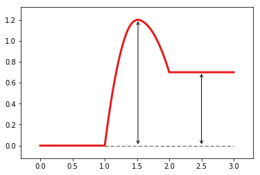

给Energy Profile添加辅助线
==========================

.. code:: ipython3

    %matplotlib inline

创建画布
--------

.. code:: ipython3

    from catplot.ep_components.ep_canvas import EPCanvas
    canvas = EPCanvas()

.. image:: output_3_0.png

创建Energy Profile Line
-----------------------

.. code:: ipython3

    from catplot.ep_components.ep_lines import ElementaryLine
    line = ElementaryLine([0.0, 1.2, 0.7], color="#E51D1D")

添加到画布中
------------

.. code:: ipython3

    canvas.add_line(line)

添加辅助线
----------

添加水平线
~~~~~~~~~~

.. code:: ipython3

    canvas.add_horizontal_auxiliary_line(line)

.. parsed-literal::

    <catplot.ep_components.ep_canvas.EPCanvas at 0x10e9bbcc0>

添加垂直线
~~~~~~~~~~

.. code:: ipython3

    canvas.add_vertical_auxiliary_lines(line)

.. parsed-literal::

    <catplot.ep_components.ep_canvas.EPCanvas at 0x10e9bbcc0>

效果
----

.. code:: ipython3

    canvas.draw()

.. code:: ipython3

    canvas.figure

