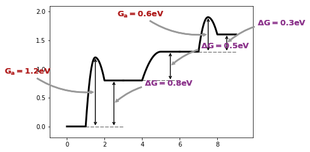

给chain添加辅助线和注释
=======================

.. code:: ipython3

    %matplotlib inline

.. code:: ipython3

    from catplot.ep_components.ep_canvas import EPCanvas
    from catplot.ep_components.ep_lines import ElementaryLine
    from catplot.ep_components.ep_chain import EPChain

创建画布和链
------------

.. code:: ipython3

    canvas = EPCanvas()
    
    # 创建三条带有反应的线
    line1 = ElementaryLine([0.0, 1.2, 0.8], rxn_equation='A_s + B_s <-> A-B_2s -> AB_g + 2*_s')
    line2 = ElementaryLine([0.0, 0.5], rxn_equation='AB_g + *_s -> AB_s')
    line3 = ElementaryLine([0.0, 0.6, 0.3], rxn_equation='AB_s + *_s <-> A-B_2s -> A_s + B_s')
    
    # 将三条线进行拼接
    chain = EPChain([line1, line2])
    chain.append(line3)  # 也可以单独拼接哦

.. image:: output_4_0.png

将链添加到画布
--------------

.. code:: ipython3

    canvas.add_chain(chain)

添加辅助线和注释
----------------

.. code:: ipython3

    canvas.add_all_horizontal_auxiliary_lines()  # 添加水平辅助线
    canvas.add_all_vertical_auxiliary_lines()    # 添加垂直辅助线
    canvas.add_all_energy_annotations()          # 添加能量标注

.. parsed-literal::

    <catplot.ep_components.ep_canvas.EPCanvas at 0x10d514a58>

绘制效果
--------

.. code:: ipython3

    canvas.draw()
    canvas.figure

