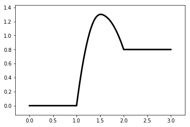

.. code:: ipython3

    %matplotlib inline
    from catplot.ep_components.ep_canvas import EPCanvas
    from catplot.ep_components.ep_lines import ElementaryLine

画布会随着内容自动更新大小
==========================

.. code:: ipython3

    canvas = EPCanvas()

.. image:: output_2_0.png

.. code:: ipython3

    line = ElementaryLine([0.0, 1.3, 0.8])

.. code:: ipython3

    canvas.add_line(line)
    canvas.draw()
    canvas.figure

.. code:: ipython3

    line.translate_state("FS", -1.0)

.. code:: ipython3

    canvas.draw()

.. code:: ipython3

    canvas.figure

.. image:: output_7_0.png

