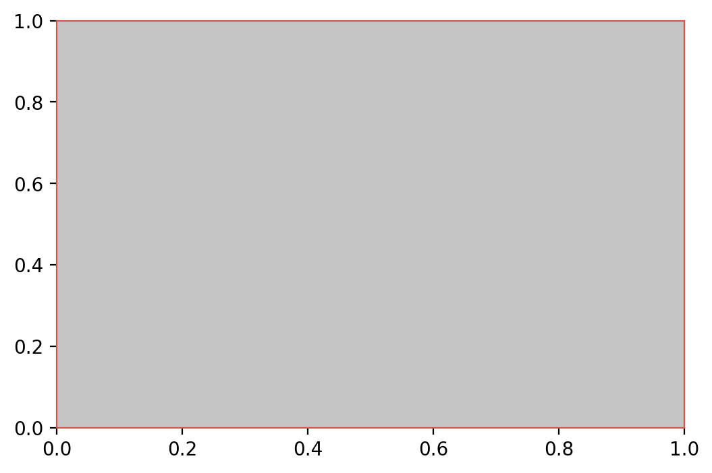
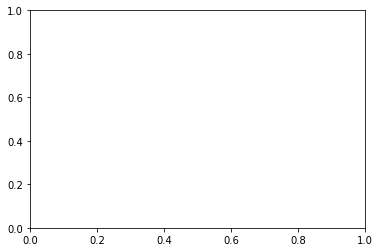

.. code:: ipython3

    %matplotlib inline

画布定制
========

.. code:: ipython3

    from catplot.ep_components.ep_canvas import EPCanvas

创建自定义画布
--------------

.. code:: ipython3

    canvas = EPCanvas(margin_ratio=0.2,     # 边缘留白的比例
                      figsize=(6, 4),       # 画布大小(单位：英寸)
                      dpi=200,              # 每英寸所包含的像素点
                      facecolor="#C5C5C5",  # 画布背景色
                      edgecolor="#CE594B")  # 边框的颜色

    可以看到上面的画布大小、边框颜色以及背景色与默认均不相同

来个默认的做个对比
------------------

.. code:: ipython3

    canvas2 = EPCanvas()

