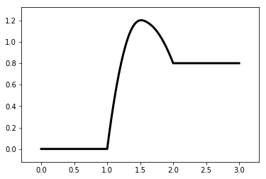

.. code:: ipython3

    %matplotlib inline

catplot 的简单使用
==================

.. code:: ipython3

    from catplot.ep_components.ep_canvas import EPCanvas
    from catplot.ep_components.ep_lines import ElementaryLine

创建一个Energy Profile 画布
---------------------------

.. code:: ipython3

    canvas = EPCanvas()

.. image:: output_4_0.png

创建针对一个基元反应的 Energy Profile Line
------------------------------------------

.. code:: ipython3

    line = ElementaryLine([0.0, 1.2, 0.8])

像画布中添加 Energy Profile Line
--------------------------------

.. code:: ipython3

    canvas.add_line(line)

进行绘制
--------

.. code:: ipython3

    canvas.draw()

显示效果
--------

.. code:: ipython3

    canvas.figure

